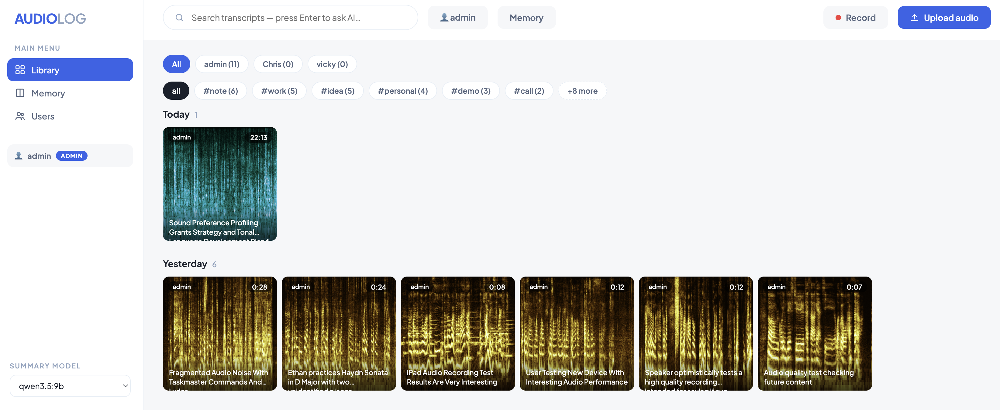
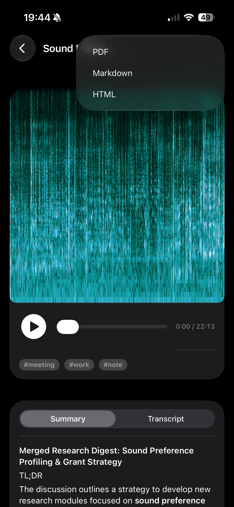
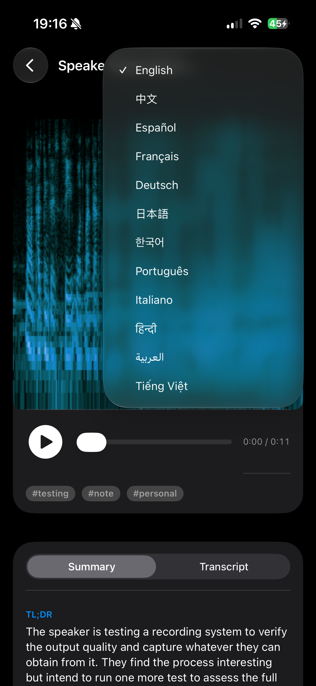
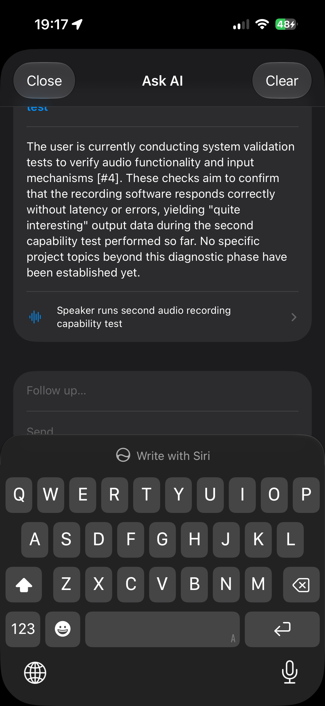
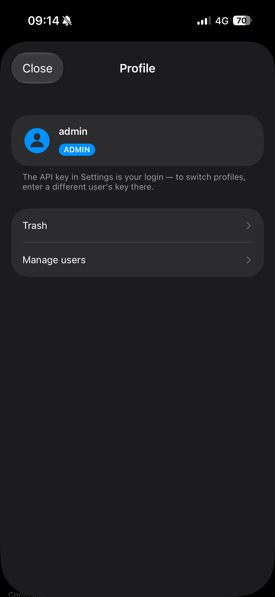

# audio-log

**A self-hosted, Google Photos-style library for your voice.** Drop audio into a
watched folder (or record / upload from any device), and audio-log transcribes
it, writes an AI summary, titles and tags it, renders a color-coded spectrogram
thumbnail, and makes everything searchable — with a long-term memory that
connects the dots across your whole archive. Runs entirely on your own Mac; use
it from the browser, an installable phone app, or the native iOS app.



## Key features

- 🎨 **Color-coded spectrogram thumbnails** — every recording becomes a square
  "photo" of its own sound. The texture is the audio; the color encodes the day
  it was added, so sessions are distinguishable at a glance.
- 🎙️ **Transcription** — mlx-whisper (Apple Silicon) produces timestamped
  transcripts that highlight and auto-scroll in sync with playback; tap any line
  to jump the audio there.
- 📝 **AI summaries, titles & tags** — every recording is digested by a local
  Ollama model (TL;DR, key points, decisions, action items) and gets a
  descriptive title and 1–3 filterable tags.
- 🌐 **Translate into 12 languages** — summaries and the memory translate to
  中文, Español, Français, Deutsch, 日本語, 한국어, and more, cached per language.
- 🔍 **Semantic search + Ask AI** — full-text *and* embedding-based search; press
  Enter to ask a question and get a grounded, conversational answer with cited,
  tappable sources.
- 📖 **Long-term memory** — distills your whole library into a living document,
  auto-updated as new recordings come in, and feeds Ask AI so it understands the
  big picture. Exclude any recording; translate the memory.
- 📤 **Export** — any recording or the memory as **PDF, Markdown, or HTML**, in
  whichever language you're viewing.
- 👥 **Multi-user** — the API key is the login; an admin sees everything and
  manages users, while each user sees only their own recordings (search, Ask AI,
  and memory are all scoped per user).
- 🗑️ **Trash with 30-day restore**, 🎙️ **in-browser & native recording**,
  🎚️ **runtime model picker**, and drag-and-drop / multi-select throughout.

## Three ways to use it

| Web app | Native iPhone / iPad app | Installable PWA |
|---|---|---|
| Full-featured dashboard in any browser | SwiftUI app in `ios/`, talks to your server | "Add to Home Screen" from Safari |

<p align="center">
  
  &nbsp;
  
  &nbsp;
  
  &nbsp;
  
</p>

## Requirements

- Apple Silicon Mac (mlx-whisper)
- `ffmpeg` (`brew install ffmpeg`)
- [Ollama](https://ollama.com) running with a model pulled (default `qwen3.6:27b`;
  `nomic-embed-text` for semantic search)

## Run

```bash
# first time: create the venv and install dependencies
python3 -m venv .venv
.venv/bin/pip install -r requirements.txt

# start the service (0.0.0.0 so iPhone/iPad on the same WiFi can connect)
.venv/bin/uvicorn app.main:app --host 0.0.0.0 --port 8300 --reload
```

Open http://localhost:8300. Files dropped into `data/input/` (or uploaded /
recorded / drag-and-dropped) are processed automatically; results are stored in
SQLite and written to `data/output/<name>-<hash>/` as `transcript.md`,
`summary.md`, `meta.json`.

The first transcription downloads the Whisper model (~1.6 GB) from Hugging Face
into `~/.cache/huggingface/`.

## Native iOS app

A full SwiftUI client lives in `ios/AudioLog.xcodeproj` (iOS 17+, Xcode 16+):
library, synced-transcript player, translation, Ask AI chat, memory, users,
trash, native mic recording, and export via the share sheet.

1. Open the project in Xcode → **Signing & Capabilities** → select your Team.
2. Run the server with `--host 0.0.0.0`, then ⌘R onto your device.
3. In the app: **Settings** → set the server URL (and API key, if the server
   uses one) → **Test connection**.

Prefer no build? The web UI installs as a **PWA**: open the server's address in
Safari on the phone and tap **Share → Add to Home Screen**.

## API

| Method | Path | Purpose |
|---|---|---|
| GET | `/api/files` | list recordings (scoped to the caller; admin sees all) |
| GET | `/api/files/{id}` | detail incl. transcript, summary, tags |
| GET | `/api/files/{id}/thumb` · `/audio` | spectrogram PNG · playable audio (m4a-transcoded if needed) |
| POST | `/api/files/{id}/translate?lang=` | translate the summary (cached per language) |
| GET | `/api/files/{id}/export?format=&lang=` | export as `md` / `html` / `pdf` |
| POST | `/api/files/{id}/rerun` | reprocess |
| DELETE | `/api/files/{id}` · POST `/restore` | trash / restore |
| POST | `/api/upload` | upload an audio file |
| GET | `/api/search?q=` · POST `/api/ask` | search · grounded conversational answer |
| GET/POST/DELETE | `/api/memory` … `/build` `/translate` `/export` | long-term memory |
| GET | `/api/languages` | supported translation languages |
| GET | `/api/trash` | trashed recordings |
| GET/POST/DELETE | `/api/users` … | admin: manage users |
| GET/POST | `/api/models` · `/api/model` | list / select the Ollama summary model |
| GET | `/api/config` | effective configuration |

All `/api` requests require the API key when `AUDIOLOG_API_KEY` is set (header
`X-API-Key`, `?key=`, or cookie); the key identifies the user.

## Users

The API key is the login. On first start the configured `AUDIOLOG_API_KEY`
becomes the **admin** account (all recordings + user management). Create more
users from the **Users** panel — each gets their own key and a private library;
search, Ask AI, and memory are scoped per user. Watched-folder files belong to
the admin.

## Google Drive sync

Install [Google Drive for desktop](https://www.google.com/drive/download/), then
wire two folders in `.env`:

```bash
AUDIOLOG_EXTRA_INPUT_DIRS=/Users/<you>/Library/CloudStorage/GoogleDrive-<account>/My Drive/AudioLog/inbox
AUDIOLOG_PUBLISH_DIR=/Users/<you>/Library/CloudStorage/GoogleDrive-<account>/My Drive/AudioLog/digests
```

Audio dropped into the Drive `inbox` (from any device) is transcribed
automatically, and each finished job's outputs are mirrored to `digests`, which
Drive syncs back everywhere.

## Remote access & HTTPS (Tailscale)

Install [Tailscale](https://tailscale.com) on the Mac and your devices (same
account) and the server is reachable anywhere at
`http://<your-mac>.<tailnet>.ts.net:8300` — private to your tailnet, no ports
opened. Do **not** use Tailscale *Funnel* for this server (it would expose an
unauthenticated API publicly — set `AUDIOLOG_API_KEY` at minimum).

For HTTPS (needed for in-browser mic recording away from localhost), run
`tailscale serve --bg 8300`; Tailscale then serves
`https://<your-mac>.<tailnet>.ts.net` with a valid certificate.

## Configuration (env vars)

Values can also be set in a git-ignored `.env` file in the project root.

| Variable | Default | Meaning |
|---|---|---|
| `AUDIOLOG_INPUT_DIR` | `data/input` | watched folder |
| `AUDIOLOG_OUTPUT_DIR` | `data/output` | where results are written |
| `AUDIOLOG_WHISPER_MODEL` | `mlx-community/whisper-large-v3-turbo` | HF repo of the mlx whisper model |
| `AUDIOLOG_OLLAMA_MODEL` | `qwen3.6:27b` | Ollama model (also selectable at runtime in the UI) |
| `AUDIOLOG_EMBED_MODEL` | `nomic-embed-text` | Ollama embedding model for semantic search |
| `OLLAMA_URL` | `http://localhost:11434` | Ollama server |
| `AUDIOLOG_API_KEY` | *(empty = auth off)* | require this key on all `/api` requests; becomes the admin login. Generate with `openssl rand -hex 16`. |
| `AUDIOLOG_EXTRA_INPUT_DIRS` | *(empty)* | comma-separated additional watched folders |
| `AUDIOLOG_PUBLISH_DIR` | *(empty)* | mirror each job's outputs here |
| `AUDIOLOG_SCAN_INTERVAL` | `3` | seconds between input dir scans |
| `AUDIOLOG_DATA_DIR` | `./data` | base dir for db, caches, default input/output |

## Data layout

```
data/
  audiolog.db      # SQLite: recordings, transcripts, summaries, tags, users,
                   #   memory, translations, embedding vectors, FTS5 index
  input/           # watched folder (source audio stays here)
  output/          # <name>-<hash>/ transcript.md, summary.md, meta.json
  thumbs/          # cached spectrogram PNGs (by content hash + date hue)
  transcode/       # cached m4a copies for browser playback
```

Deleting `thumbs/` or `transcode/` is safe — they regenerate on demand.
