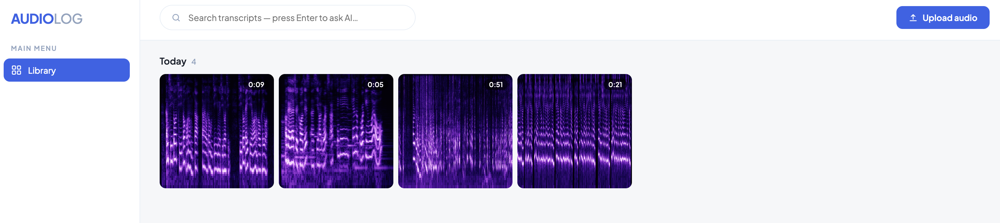
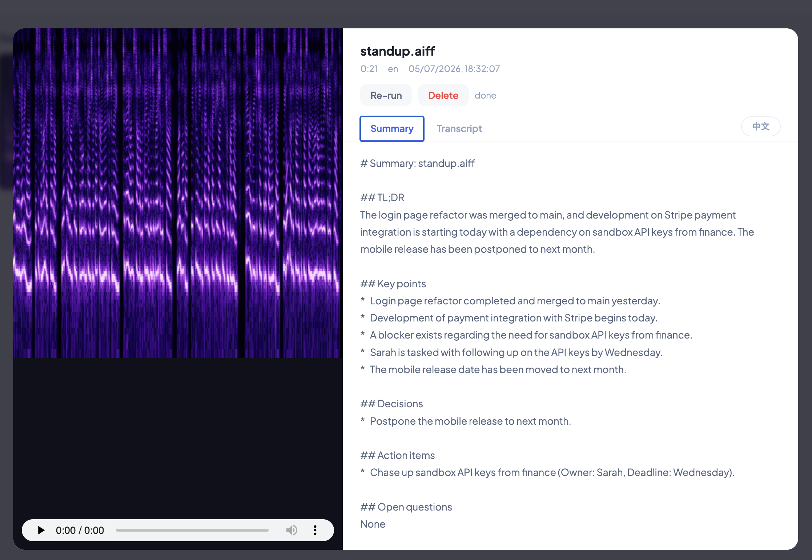

# audio-log

Local audio transcription + digest pipeline with a Google Photos-style web UI:
drop audio files into a watched folder (or upload via the browser), get a
timestamped transcript and a point-form summary, browse everything as a grid of
spectrogram thumbnails, and ask an AI assistant questions about your recordings.

Pipeline: **watched input dir → mlx-whisper (transcribe) → Ollama (summarize) → SQLite + markdown output dir**

Everything runs locally — no cloud services.





## Key features

- 🎨 **Color-coded spectrogram thumbnails** — every recording becomes a square
  "photo" of its own sound. The texture is the audio (speech, pauses, music);
  the color encodes the day it was added — same day, same hue; different days
  land far apart on the color wheel — so you can tell sessions apart at a glance.
- 🖼️ **Google Photos-ish library** — recordings grouped by day in a tile grid,
  hover for details, click for a full preview, multi-select tiles to delete in
  one go, drag-and-drop anywhere to upload.
- 🎙️ **Transcription** — mlx-whisper (Apple Silicon) produces timestamped
  transcripts that highlight and auto-scroll in sync with playback; click any
  line to jump the audio there.
- 📝 **Summaries** — every recording is digested by a local Ollama model into
  TL;DR, key points, decisions, action items, and open questions.
- 🌐 **EN ⇄ 中文 translation** — one click on the summary tab translates the
  digest to Simplified Chinese (generated once, cached forever).
- 🔍 **Search + Ask AI** — full-text search across all transcripts as you
  type; press Enter to ask a question and get a grounded answer with cited,
  clickable sources.

## Requirements

- Apple Silicon Mac (mlx-whisper)
- `ffmpeg` (`brew install ffmpeg`)
- [Ollama](https://ollama.com) running with the summary model pulled (default `qwen3.6:27b`)

## Run

```bash
# first time: create the venv and install dependencies
python3 -m venv .venv
.venv/bin/pip install -r requirements.txt

# start the service
.venv/bin/uvicorn app.main:app --port 8300 --reload
```

Open http://localhost:8300. Files dropped into `data/input/` (or uploaded /
drag-and-dropped onto the page) are processed automatically; results land in
`data/output/<name>-<hash>/` as `transcript.md`, `summary.md`, `meta.json`, and
are also stored in SQLite for search.

The first transcription downloads the Whisper model (~1.6 GB) from Hugging Face
into `~/.cache/huggingface/`.

## Web UI

- **Library grid** — recordings grouped by day, each shown as a square
  spectrogram thumbnail. The thumbnail's color encodes the ingest date (same
  day = same hue, different days = clearly different hues); the texture is the
  audio itself.
- **Preview** — click a tile: audio player, summary, and a transcript that
  highlights and scrolls in sync with playback. Click a transcript line to
  seek. Space toggles play/pause.
- **Summary translation** — 中文/EN toggle on the Summary tab; the Chinese
  version is generated once by Ollama and cached.
- **Search** — the top bar full-text searches filenames, transcripts, and
  summaries as you type.
- **Ask AI** — press Enter in the search bar to ask a question; the assistant
  retrieves the most relevant transcript excerpts and answers with cited,
  clickable sources.
- **Delete** — from the preview, or select multiple tiles via their check
  circles and use the Delete button that appears in the header.
- **Mic recording** — currently disabled (commented out in
  `static/index.html`): a Chrome/macOS audio-service crash triggered by ending
  mic captures breaks all browser audio until restart. `/mictest` is a
  standalone diagnostic page — Test 4's beep failing means the browser's audio
  output is wedged (fix: reboot or `sudo killall coreaudiod`), not an app bug.

## API

| Method | Path | Purpose |
|---|---|---|
| GET | `/api/files` | list recordings |
| GET | `/api/files/{id}` | detail incl. transcript + summary |
| GET | `/api/files/{id}/thumb` | spectrogram PNG (cached) |
| GET | `/api/files/{id}/audio` | playable audio (transcoded to m4a if needed) |
| POST | `/api/files/{id}/translate` | Chinese summary (generated once, cached) |
| POST | `/api/files/{id}/rerun` | reprocess |
| DELETE | `/api/files/{id}` | delete audio, outputs, caches, DB row |
| POST | `/api/upload` | upload an audio file |
| GET | `/api/search?q=` | full-text search (FTS5) |
| POST | `/api/ask` | `{"question": …}` → grounded answer + sources |
| GET | `/api/config` | effective configuration |

## Configuration (env vars)

| Variable | Default | Meaning |
|---|---|---|
| `AUDIOLOG_INPUT_DIR` | `data/input` | watched folder (e.g. a Drive-synced dir) |
| `AUDIOLOG_OUTPUT_DIR` | `data/output` | where results are written |
| `AUDIOLOG_WHISPER_MODEL` | `mlx-community/whisper-large-v3-turbo` | HF repo of the mlx whisper model |
| `AUDIOLOG_OLLAMA_MODEL` | `qwen3.6:27b` | Ollama model for summaries/translation/assistant |
| `OLLAMA_URL` | `http://localhost:11434` | Ollama server |
| `AUDIOLOG_SCAN_INTERVAL` | `3` | seconds between input dir scans |
| `AUDIOLOG_DATA_DIR` | `./data` | base dir for db, caches, default input/output |

## Data layout

```
data/
  audiolog.db      # SQLite: job rows, transcripts, summaries, FTS5 index
  input/           # watched folder (source audio stays here)
  output/          # <name>-<hash>/ transcript.md, summary.md, meta.json
  thumbs/          # cached spectrogram PNGs (by content hash + date hue)
  transcode/       # cached m4a copies for browser playback
```

Deleting `thumbs/` or `transcode/` is safe — they regenerate on demand. The
markdown files in `output/` are re-imported into SQLite at startup if the DB
loses them (and vice versa, the DB is the source for the UI).
